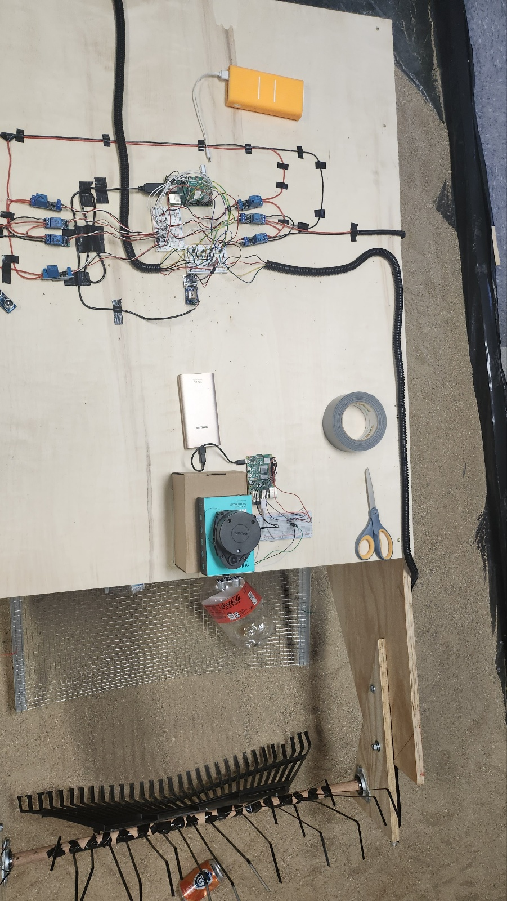

### KSW_2022_Fall_Program

## 🤖 2022 Purdue Beach Cleaning Robot by TEAM C.C

#### 🌊 Project Title

    Developmental Process and Application of an Eco-Friendly, Autonomous Beach-Cleaning Robot

#### 🌊 Problem Statement
    
      Trash that beach-goers throw away and has been washed up by natural disasters contribute to beach pollution. Beach pollution is
    harmful to the wildlife that lives on the beach, the residents, tourists, and especially the beach itself. Beach pollution is
    an issue for coastal area economies due to the fact that pollution deters tourism; marine pollution is a problem in many coastal
    areas of the United States as it affects tourism and recreation which contributes approximately $124 billion in gross domestic
    product.
    
      ABCbot has the power and capability to rid beaches of pollution by itself. ABCbot automatically drives using GPS which
    means that it minimizes human interference and clears a wider range. In addition, the idea of employing ABCbot instead of humans
    or other types of robots makes the beach cleaning process more efficient and cost-effective.
    
      After all, those expected effects mean that ABCbot is able to broaden the usage of robots in an eco-friendly area.

#### 🌊 Novelty

    The first Autonomous driving Beach Cleaning Robot with designated GPS tracking!
       => ABCbot is possible to clean the beach while avoiding obstacles over a wide range.
      
    Optimized robot for detect the obstacles in real time!
       => By combining RPLiDAR and proximity sensors to examine the distance from the ABCbot in real time, it can detects
          obstacles in front of the robot.

    An Eco-friendly robot!

#### 🌊 System Overview

   

   &nbsp;&nbsp;&nbsp;
   

    1. One raspberry pi 4B is used for the driving unit equipping magnetometer sensor, DC motors relay, GPS, and proximity sensors.
    
    2. Another raspberry pi 4B is utilized as a detection unit arming LiDAR and proximity sensor.
    
    3. Two raspberry pi 4Bs communicate with each other through ROS2 Foxy.
    
    4. All the raspberry pi 4Bs and sensors have power supplied by a solar panel.
    
    
#### 🌊 Flow Chart

    
    

    1.  Until the ABCbot button is pushed again, it keeps running and the terminating order is the reverse order of starting order.
    
    2. There are two raspberry pi, one for driving control(RPi 1) and the other for obstacle detection(RPi 2).
    
    3-1. RPi 1 drives the robot following GPS coordinates while the proximity sensors detect nothing.
    
    3-2. If the proximity sensors attached to RPi 1 detect the obstacle, RPi 1 stops driving and waits for a signal from RPi 2.
    
    3-3. After receiving a signal from RPi 2, it resumes moving as avoiding an obstacle or not according to the type of the signal; driving or avoiding.
    
    4-1. RPi 2 takes charge of accurate obstacle detection and it starts with a proximity sensor and a LiDAR.
    
    4-2. If they detect an obstacle, RPi 2 sends an avoiding signal. Otherwise, RPi 2 sends a driving signal.

#### 🌊 Environment Setting
    
    - Raspberry Pi OS : Ubuntu Server 20.04.5 LTS (64-bit)
    
    - Python version 3.8.10 
    
    - Raspberry Pi 4 Model B+ (8GB)
    
    - ROS2 foxy
    
    - Android Gradle Plugin Version: 7.3.1
    
    - Gradle Version 7.4
    
    - Java 8
    
    - Android Studio Dolphin | 2021.3.1 Patch 1

#### 🌊 Installation

   1. [ROS 2 foxy](https://docs.ros.org/en/foxy/Installation/Ubuntu-Install-Debians.html)

   2. [Creating a workspace](https://docs.ros.org/en/foxy/Tutorials/Beginner-Client-Libraries/Creating-A-Workspace/Creating-A-Workspace.html)
   
   3. go to [💡Detection💡](#detection)

   4. Set same ROS_DOMAIN_ID on both pi  

    $ export ROS_DOMAIN_ID=[your_own_id]
    $ source /opt/ros/your_ros2_distribution/setup.bash
    
   5. Set the environment variables  
   
    $ cd [the directory you've cloned the code at]/C.C/test  
    $ source set_env.sh
    
#### 💡Detection💡

##### 1. create interfaces package  
    $ ros2 pkg create --build-type ament_cmake interfaces

##### 2. download [requirements1.txt](requirements1.txt)
    $ pip install -r requirements1.txt
##### 3. install rplidar ROS2 onto Raspberry Pi  
    $ cd ~
    $ sudo apt install ros-foxy-rplidar-ros
    $ source /opt/ros/foxy/setup.bash
    $ ros2 run rplidar_ros rplidar_composition –ros-args -p serial_port:=/dev/ttyUSB0 -p frame_id:=laser_frame -p angle_compensate:=true -p scan_mode:=Standard

###### IF _**Could not open port /dev/ttyUSB0: [Errno 2] No such file or directory: '/dev/ttyUSB0'**_   
    $ sudo apt-get install minicom
    $ sudo minicom -s
      > Serial port setup
      > Press A, change serial device into /dev/ttyUSB0 serial device, and press enter
      > Save setup as dfl
      > exit

##### 4. install proximity sensor onto Raspberry Pi
###### IF _**RuntimeError: No access to /dev/mem.  Try running as root!**_   
    $ sudo chown root.gpio /dev/gpiomem
    $ sudo chmod g+rw /dev/gpiomem

*change directory to your workspace*   
_**Creating a package named 'obstacles_detection' in your workspace**_  
*Copy [obstacles_detect_node.py](test/ros2_ws/src/obstacles_detection/obstacles_detection/obstacles_detect_node.py) to your node*  

    $ colcon build
    $ . install/setup.bash
    $ ros2 run obstacels_detection talker
   
  
   
#### 🌊 Detection Demo Video
https://user-images.githubusercontent.com/55439296/208178546-a4a54872-fd0f-4853-ab82-17b4cc3daf0b.mp4

##### ⬇️ Full Video (Detection result when an obstacle appears) 
https://www.youtube.com/watch?v=AmNRsN1PqKk

#### 💡Driving💡

##### 1. Download [requirements2.txt](requirements2.txt) and install the required modules
    $ pip install -r requirements2.txt
    
##### 2. Run bash files
    $ cd [the directory you've cloned the code at]/C.C/test
    $ sudo bash open_port.sh
    $ bash run_motor.sh  
    
    The path receiver starts first and motor listener waits for the coordinates information file that will be generated depending on the Android app.

##### 3. Send the GPS coordinates through app Demo Video
https://user-images.githubusercontent.com/55439296/208178566-7fd93092-28b6-481c-9385-f69d69d37829.mp4

###### ⬇️Full Video
https://www.youtube.com/watch?v=vakZjTlbfEM?t=0s

#### 💡Android Application💡

#### Emulator
    
    1. Virtual Device: Pixel 2 API 33
    
    2. Physical Device: LM-G820N
    - Android version: 12
    - Software version: G820N40c
    
##### 1. Install [Android Studio](https://developer.android.com/studio/?gclid=CjwKCAiAy_CcBhBeEiwAcoMRHAuJUwNwEbAzgpnR03_KpVV2VP8KKFxhQOie26MRg7dqfRZRTnVEJhoCYoUQAvD_BwE&gclsrc=aw.ds)

##### 2. 

 
 

#### 🌊 Collaborator
     
       Eunmin Kim
       - Dankook Univeristy
       - Majoring in Industrial Security
       - maexc834@naver.com
       - https://github.com/Min1222Ag
       
       Booyong Kim
       - Sangmyung University
       - Majoring in Computer Science
       - hapata1120@gmail.com
       - https://github.com/KBY538
      
       Seoyeong Lee
       - Daegu Catholic University
       - Majoring in Computer Engineering
       - lsyoung66@naver.com
       - https://github.com/lsyoung66
       
       Hanbyeol Lee
       - Chung-Ang University
       - Majoring in Computer Science and Engineering
       - yhb1834@cau.ac.kr
       - https://github.com/yhb1834
    
       Jeeyoung Oh
       - Chung-Ang University
       - Majoring in Computer Science and Engineering
       - jeeyoung9907@cau.ac.kr
       - https://github.com/ohjeeyoung
    
       Caleb Ikalina
       - Purdue University
       - Majoring in Computer and Information Technology, Forensic Sciences
       - maxli32145@gmail.com
       - cikalina@purdue.edu
       - https://github.com/CalebIkalina

