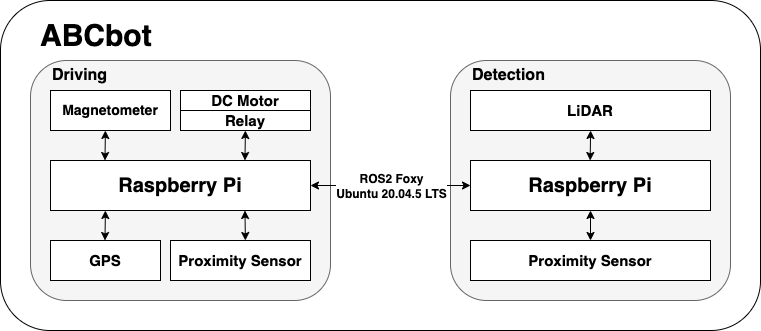

### KSW_2022_Fall_Program

## 🤖 2022 Purdue Beach Cleaning Robot by TEAM C.C

#### 🌊 Project Title

    Developmental Process and Application of an Eco-Friendly, Autonomous Beach-Cleaning Robot

#### 🌊 Problem Statement
    
      In 2016, the United States was responsible for 42 million metric tons of plastic waste, which made it the largest contributor
    in the world. The U.S is also ranked 3rd in the world when it comes to depositing pollution onto its own shorelines. There is
    an estimated 95,000 miles of shoreline in the United States as well as an estimated 90,000 beaches across the country. To say  
    pollution and waste are an issue for the beaches, is an understatement.

      Litter on the beaches affect not only water, but also the wildlife, local residents, and even the economic state of the area.  
    Trash can make living conditions for any living organism, unsuitable. This happens when a turtle mistakes a plastic bag as a  
    jellyfish, causing the turtle to consume the trash because jellyfish are a part of a turtle's diet. When pollution infects
    a beach, it make it look unpleasant, which in turn would turn off tourists from wanting to visit the beach while also  
    potentially making local residents want to move from the area. These two instances combined can have a devastating impact on  
    the economy as tourism is a significant portion of the U.S's economy. 

      There is no easy solution to this problem, however the development of a self-driving robot that can gather and dispose of  
    trash on its own is a good start.

#### 🌊 Novelty

    The first Autonomous driving Beach Cleaning Robot with designated GPS points!
       => ABCbot is possible to clean the beach while avoiding obstacles over a wide range.
      
    Optimized robot for examine the distance in real time!
       => By combining RPLiDAR, camera, and proximity sensors to examine the distance from the ABCbot in real time, it detects
          obstacles in front of the robot and uses Google Coral Edge Board to accelerate computing.

    An Eco-friendly robot!
       => ABCbot takes power from solar panels and windmills.

#### 🌊 System Overview

   

    1. One raspberry pi 4B is used for the driving unit equipping magnetometer sensor, DC motors relay, GPS, and proximity sensors.
    
    2. Another raspberry pi 4B is utilized as a detection unit arming LiDAR and proximity sensor.
    
    3. Two raspberry pi 4Bs communicate with each other through ROS2 Foxy.
    
    4. All the raspberry pi 4Bs and sensors have power supplied by a solar panel.
    
    
#### 🌊 Flow Chart

    
    

    1.  Until the ABCbot button is pushed again, it keeps running and the terminating order is the reverse order of starting order.
    
    2. There are two raspberry pi, one for driving control(RPi 1) and the other for obstacle detection(RPi 2).
    
    3-1. RPi 1 drives the robot following GPS coordinates while the proximity sensors detect nothing.
    
    3-2. If the proximity sensors attached to RPi 1 detect the obstacle, RPi 1 stops driving and waits for a signal from RPi 2.
    
    3-3. After receiving a signal from RPi 2, it resumes moving as avoiding an obstacle or not according to the type of the signal; driving or avoiding.
    
    4-1. RPi 2 takes charge of accurate obstacle detection and it starts with a proximity sensor and a LiDAR.
    
    4-2. If they detect an obstacle, RPi 2 sends an avoiding signal. Otherwise, RPi 2 sends a driving signal.

  
Your README.md file must include:
(7) Environment settings (Must be very detailed with several steps.)   
#### 🌊 Environment Setting
    
    - Raspberry Pi OS : Ubuntu Server 20.04.5 LTS (64-bit)
    
    - Python version 3.8.10 
    
    - Raspberry Pi 4 Model B+ (8GB)
    
    - ROS2 foxy
    
    - Android Gradle Plugin Version: 7.3.1
    
    - Gradle Version 7.4
    
    - Java 8
    
    - Android Studio Dolphin | 2021.3.1 Patch 1

#### 🌊 Installation

   1. [ROS 2 foxy](https://docs.ros.org/en/foxy/Installation/Ubuntu-Install-Debians.html)

   2. [Creating a workspace](https://docs.ros.org/en/foxy/Tutorials/Beginner-Client-Libraries/Creating-A-Workspace/Creating-A-Workspace.html)
   
   3. go to [💡Detection💡](#detection)
    
   4. go to [💡Driving💡](#driving)
   
   5. df

   6. Set same ROS_dOMAIN_ID on both pi
      - $ export ROS_DOMAIN_ID=[your own id]
      - $ source /opt/ros/your_ros2_distribution/setup.bash

---------------
### 💡Detection💡

#### 1. create interfaces package  

#### 2. download requirements1.txt
> pip install -r requirements1.txt
#### 3. install rplidar ROS2 onto Raspberry Pi  
    $ cd ~
    $ sudo apt install ros-foxy-rplidar-ros
    $ source /opt/ros/foxy/setup.bash
    $ ros2 run rplidar_ros rplidar_composition –ros-args -p serial_port:=/dev/ttyUSB0 -p frame_id:=laser_frame -p angle_compensate:=true -p scan_mode:=Standard

> IF _**"Could not open port /dev/ttyUSB0: [Errno 2] No such file or directory: '/dev/ttyUSB0'"**_   
> $sudo apt-get install minicom  
> $sudo minicom -s  
>>Serial port setup  
>>Press A, change serial device into /dev/ttyUSB0 serial device, and press enter  
>>Save setup as dfl  
>>exit  

#### 4. install proximity sensor onto Raspberry Pi

*change directory to your workspace*   
_**Creating a package named 'obstacles_detection' in your workspace**_  
*Copy [obstacles_detect_node.py](test/ros2_ws/src/obstacles_detection/obstacles_detection/obstacles_detect_node.py) to your node*  

    $ colcon build
    $ . install/setup.bash
    $ ros2 run obstacels_detection talker
    
-----------

### 💡Driving💡

   - Creating a package named 'motor'
   - 
#### 🌊 Collaborator
     
       Eunmin Kim
       - Dankook Univeristy
       - Majoring in Industrial Security
       - maexc834@naver.com
       - https://github.com/Min1222Ag
       
       Booyong Kim
       - Sangmyung University
       - Majoring in Computer Science
       - hapata1120@gmail.com
       - https://github.com/KBY538
      
       Seoyeong Lee
       - Daegu Catholic University
       - Majoring in Computer Engineering
       - lsyoung66@naver.com
       - https://github.com/lsyoung66
       
       Hanbyeol Lee
       - Chung-Ang University
       - Majoring in Computer Science and Engineering
       - yhb1834@cau.ac.kr
       - https://github.com/yhb1834
    
       Jeeyoung Oh
       - Chung-Ang University
       - Majoring in Computer Science and Engineering
       - jeeyoung9907@cau.ac.kr
       - https://github.com/ohjeeyoung
    
       Caleb Ikalina
       - Purdue University
       - Majoring in Computer and Information Technology, Forensic Sciences
       - maxli32145@gmail.com
       - cikalina@purdue.edu
       - https://github.com/CalebIkalina

